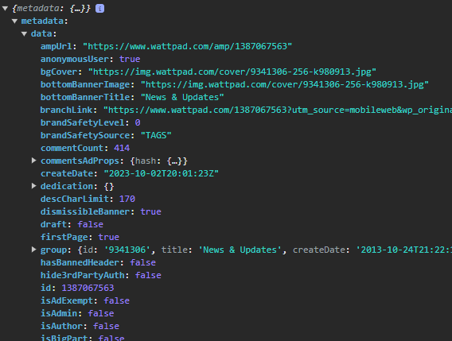

# WattpadConnect for JavaScript

Unfortunately, the wattpad API no longer exists for programmers who are not familiar with wattpad.
WattpadConnect is an alternative interface that can still be used to retrieve data from the wattpad platform easily & for free.
It is extremely easy to use and you can get almost all data from wattpad with it.
Ingenious, isn't it?

With this interface, you can get data from this URLs:
- wattpad.com/chapteridxyz
- wattpad.com/story/storyidxyz
- wattpad.com/user/useraliasxyz

**Notice: This software is not endorsed or affiliated with Wattpad.**

Overview:

- [WattpadConnect API for JavaScript](#WattpadConnect-API-for-JavaScript)
  - [❗DISCLAIMER❗](#❗DISCLAIMER❗)
  - [🤷‍♂️ How to use it?](#🤷‍♂️-How-to-use-it)
  - [👉 Examples](#👉-Examples)
  - [🪲 BUGS](#🪲-BUGS)
  - [📋  What can I get?](#📋--What-can-I-get)

## ❗DISCLAIMER❗
Use of this software is at your own risk.
The author of this software disclaims all warranties,
whether expressed or implied, as to the functionality,
security, or legality of the software.

Please be aware that the use of this software may be in
violation of Wattpad's terms of service, which explicitly
prohibit scraping, crawling, or any other method to remove
content from any part of the Site or Services.
It is your responsibility to ensure that your use of
the software complies with applicable laws and Wattpad's terms of service.

The author of this software expressly disclaims any liability
for damages, legal consequences, or losses resulting from the
use of the software. Use this software at your own discretion.

It is advisable to use the software only for lawful purposes and in
accordance with applicable laws and regulations.


## 🤷‍♂️ How to use it?
It's very simple.

1. #### Import it: 
Just paste this in the Header of your HTML file:
```HTML
<script src="path/to/api.js"></script>
```
Don't forget to replace "path/to/api.js" with the path of the api.js file.

2. #### Get JSON:
To get data, just run the function with the URL.
You can extract information from the following URLs:
- wattpad.com/chapteridxyz
- wattpad.com/story/storyidxyz
- wattpad.com/user/useraliasxyz
E.g. to get data about a wattpad user:
```javascript
const userdata = await extractInformationFromWattpad('https://www.wattpad.com/user/username');
```
Replace 'username' with the username of the user which informations you want to get.
Now, `userdata` contains a JSON with all the user's data.

3. #### Use JSON:
So now you got a whole JSON, but how to get the data?
To extract the single informations, use this (example):
```javascript
// gets the user's avatar image url:
const avatar = userdata.metadata.data[0].avatar;
// gets the user's description:
const description = userdata.metadata.data[0].description;
```
Scroll down to see more examples:

## 👉 Examples

Okay, let's start with a HTML template:
`index.html`
```html
<!DOCTYPE html>
<html lang="en">
<head>
    <meta charset="UTF-8">
    <meta name="viewport" content="width=device-width, initial-scale=1.0">
    <title>test</title>
    <!-- Import the wattpad connect script: -->
    <script src="wattpadconnect.js"></script>
    <!-- And lets import a custom script: -->
    <script src="script.js"></script>
</head>
<body>
</body>
</html>
```
Now lets add some code to the `script.js`:
```javascript
    // In this example, we'll use this to run the function myFunc() when the window has finished loading:
    window.addEventListener('load', function () {
        myFunc(); // very creative name
    })


    async function myFunc() {
        // basic: get the json and output it to the console
        // very important: use await with the function. otherwise it will propably not work
        const json = await extractInformationFromWattpad('https://www.wattpad.com/1387067563');
        console.log(json);
    }
```

Lets take a look in the browser's console:


You are now confronted with a huge pile of data.
Let's see how you can extract the most important data.

1. #### wattpad.com/chapteridxyz:

So, in this scheme the "chapteridxyz" stands for the chapter id of the story.

Example URL: [https://www.wattpad.com/1387067563](https://www.wattpad.com/1387067563)

The URL can also include the story name and/or part(chapter) name, it doesn't matter.

`script.js`:
```javascript
    async function myFunc() {
        // basic: get the json and output it to the console
        // very important: use await with the function. otherwise it will propably not work
        const json = await extractInformationFromWattpad('https://www.wattpad.com/1387067563');
        console.log(json);

        // save the most important data in variables:
        const storytext = json.metadata.data.storyText;
        const title = json.metadata.data.title;
        const currentpage = json.metadata.data.pageNumber;
        const pages = json.metadata.data.pages; // how much pages has the CURRENT part?
        const pagetext = currentpage + ' / ' + pages; // optional: if you want to show your users on which page they are
        const storytitle = json.metadata.data.group.title;
        const storycover = json.metadata.data.group.cover; // returns the URL to the image
        const readcount = json.metadata.data.readCount;
        const commentcount = json.metadata.data.commentCount;
        const votescount = json.metadata.data.voteCount;
        const completed = json.metadata.data.group.completed; // true or false
        const description = json.metadata.data.group.description;
        const parts = json.metadata.data.group.parts; // returns an array, you may want to program a function that processes it
        const nextparturl = json..metadata.data.nextPart.url; // only aviable if there's a next part
        const authorname = json.metadata.data.group.user.name;
        const authoravatar = json.metadata.data.group.user.avatar; // returns the URL to the image
        const authoralias = json.metadata.data.group.user.username;
        const authorlink = 'https://www.wattpad.com/user/' + authoralias;
    }
```

So yes, now you know how to save the data in variables.
How they are further processed is entirely up to you.

2. #### wattpad.com/story/storyidxyz

In this scheme, the "storyidxyz" stands for the story's ID.
Example: [https://www.wattpad.com/story/9341306-news-updates](https://www.wattpad.com/story/9341306-news-updates)

`script.js`:
```javascript
    async function myFunc() {
        // basic: get the json and output it to the console
        // very important: use await with the function. otherwise it will propably not work
        const json = await extractInformationFromWattpad('https://www.wattpad.com/story/9341306-news-updates');
        console.log(json);

        // save the most important data in variables:
        const storytitle = json.metadata.data.group.title;
        const description: json.metadata.data.group.description;
        const cover = json.metadata.data.group.cover; // returns the URL to the image
        const completed = json.metadata.data.group.completed; // return true or false
        const parts = json.metadata.data.group.parts; // returns an array, you may want to program a function that processes it
        const authorname = json.metadata.data.group.user.name;
        const authorlink = 'https://www.wattpad.com/user/' + json.metadata.data.group.user.username;
        const authoravatar = json.metadata.data.group.user.avatar; // returns the URL to the image
    }
```

3. #### wattpad.com/user/useraliasxyz

In this scheme, the "useraliasxyz" stands for the user's username.
Example: [https://www.wattpad.com/user/Wattpad](https://www.wattpad.com/user/Wattpad)

`script.js`:
```javascript
    async function myFunc() {
        // basic: get the json and output it to the console
        // very important: use await with the function. otherwise it will propably not work
        const json = await extractInformationFromWattpad('https://www.wattpad.com/user/Wattpad');
        console.log(json);

        // save the most important data in variables:
        const name = json.metadata.data[0].name;
        const alias = json.metadata.data[0].username;
        const avatar = json.metadata.data[0].avatar; // returns the URL to the image
        const background = json.metadata.data[0].backgroundUrl; // returns the URL to the image
        const description = json.metadata.data[0].description;
        const createdate = json.metadata.data[0].createDate; // returns ISO 8601 standard
        const followingcount = json.metadata.data[0].followingtotal; // returns a number
        const following = json.metadata.data[0].following; // returns an array, you may want to program a function that processes it
        const followerscount = json.metadata.data[0].numFollowers; // returns a number
        const location = json.metadata.data[0].location;
        const stories = json.metadata.data[0].stories; // returns an array, you may want to program a function that processes it
        const verified = json.metadata.data[0].verified; // returns true or false
    }
```


## 🪲 BUGS
This are the known bugs:

| Bug Name                                   | Bug description                                                                 |
|:--------------------------------------------|:---------------------------------------------------------------------------------|
| story text incomplete | When the part is a little larger, the storytext variable doesn't contain the whole story part's text. Then, it only contains it til the page is full. In such a case, you just need to run it again but with a /page/pagenumber behind the URL. Example: https://www.wattpad.com/1387067563/page/2. Then this contains the text til the page is full again. And so it goes on, until at some point the next part begins.
| user's stories incomplete | Unfortunately, the array returned with json.metadata.data[0].stories can only have a maximum of three elements. So, if the user has written more than three stories, only three will be displayed anyway. With json.metadata.data[0].stories.total the complete number of published stories can be calculated.
| no reading lists and conversations aviable | coming soon.


## 📋  What can I get?
As mentioned before, you can get the data of three different types of URLs:
- wattpad.com/chapteridxyz
- wattpad.com/story/storyidxyz
- wattpad.com/user/useraliasxyz

No matter what URL you want to retrieve, you will get a JSON.
So if you want to know what data you can get, take a look at the structure of the JSONs.
Here's a list of all things you can get:


1. #### wattpad.com/chapteridxyz JSON:
| Name                          | JSON Path                                       | Description                                               |
|:------------------------------|:------------------------------------------------|:----------------------------------------------------------|
| ampUrl                        | chapterdata.metadata.data.ampUrl                | redirects to the chapter                                  |
| anonymousUser                 | chapterdata.metadata.data.anonymousUser         | except you're logged in into your wattpad account, this will be true |
| bgCover                       | chapterdata.metadata.data.bgCover               | URL to the image file of the cover                       |
| bottomBannerImage             | chapterdata.metadata.data.bottomBannerImage     | URL to the image file of the banner                       |
| bottomBannerTitle             | chapterdata.metadata.data.bottomBannerTitle     | banner title                                              |
| branchLink                    | chapterdata.metadata.data.branchLink            | just another URL which redirects to the same thing.      |
| brandSafetyLevel              | chapterdata.metadata.data.brandSafetyLevel      | only wattpad knows what this is                              |
| brandSafetySource             | chapterdata.metadata.data.brandSafetySource     | same as brandSafetyLevel - nobody knows.                |
| commentCount                  | chapterdata.metadata.data.commentCount          | number of comments                                       |
| commentsAdProps               | chapterdata.metadata.data.commentsAdProps       | again, nobody knows what that is.                       |
| createDate                    | chapterdata.metadata.data.createDate            | date and time when this chapter was created. ISO 8601 standard |
| dedication                    | chapterdata.metadata.data.dedication            | I don't know what this is.                              |
| descCharLimit                 | chapterdata.metadata.data.descCharLimit         | ¯\_(ツ)_/¯                                                 |
| dismissibleBanner             | chapterdata.metadata.data.dismissibleBanner     | just some stuff for the webpage                          |
| draft                         | chapterdata.metadata.data.draft                 | is it a draft? Let's hope it's not.                      |
| firstPage                     | chapterdata.metadata.data.firstPage             | are you on the first page?                               |
| group                         | chapterdata.metadata.data.group                 | contains information about the story                     |
| group.USReader                | chapterdata.metadata.data.group.USReader        | are you from the US?                                     |
| group.categories              | chapterdata.metadata.data.group.categories      | which categories apply? contains only numbers.           |
| group.category                | chapterdata.metadata.data.group.category        | contains the main category of the story. only numbers.   |
| group.completed               | chapterdata.metadata.data.group.completed       | true / false - is the story finished yet?                |
| group.cover                   | chapterdata.metadata.data.group.cover           | image URL of the cover                                   |
| group.cover_timestamp         | chapterdata.metadata.data.group.cover_timestamp | cover image timestamp                                    |
| group.createDate              | chapterdata.metadata.data.group.createDate      | when was this story / book created?                     |
| group.deleted                 | chapterdata.metadata.data.group.deleted         | is this story deleted? Hopefully not.                   |
| group.description             | chapterdata.metadata.data.group.description     | the story's description.                                 |
| group.draft                   | chapterdata.metadata.data.group.draft           | is this story a draft?                                  |
| group.id                      | chapterdata.metadata.data.group.id              | the story's id. Example URL: [https://www.wattpad.com/story/storyurl](https://www.wattpad.com/story/storyurl) |
| group.inLanguage              | chapterdata.metadata.data.group.inLanguage      | the story's language                                     |
| group.isAdExempt              | chapterdata.metadata.data.group.isAdExempt      | does this story contain wattpad website/app ads? If yes, this is false. |
| group.isBrandSafe             | chapterdata.metadata.data.group.isBrandSafe     | some wattpad related stuff                                   |
| group.isPaywalled             | chapterdata.metadata.data.group.isPaywalled     | wattpad paywall                                              |
| group.language                | chapterdata.metadata.data.group.language        | contains more info about the story's language           |
| group.language.id             | chapterdata.metadata.data.group.language.id     | id of the story's language                               |
| group.language.name           | chapterdata.metadata.data.group.language.name   | name of the story's language                             |
| group.mainCategory            | chapterdata.metadata.data.group.mainCategory    | the main category of this story, e.g., 'Random'         |
| group.mainCategoryEnglish     | chapterdata.metadata.data.group.mainCategoryEnglish | the main category of this story in English, in case the story's language isn't English |
| group.modifyDate              | chapterdata.metadata.data.group.modifyDate      | when was the story's last update? ISO 8601 standard     |
| group.paidModel               | chapterdata.metadata.data.group.paidModel       | I don't know what this is.                              |
| group.parts                   | chapterdata.metadata.data.group.parts           | contains all the parts of the story, inclusive of the URLs, etc. |
| group.parts.length            | chapterdata.metadata.data.group.parts.length    | how many parts?                                         |
| group.parts[number]           | chapterdata.metadata.data.group.parts[number]   | contains all the data of a single part. In this example, 'number' is a placeholder for the number of the part, ranging from 0 to infinity |
| group.parts[number].active    | chapterdata.metadata.data.group.parts[number].active | is this the active part?                             |
| group.parts[number].draft     | chapterdata.metadata.data.group.parts[number].draft | is this a draft?                                  |
| group.parts[number].id        | chapterdata.metadata.data.group.parts[number].id | id of the part (URL usage: [https://www.wattpad.com/partid](https://www.wattpad.com/partid)) |
| group.parts[number].rating    | chapterdata.metadata.data.group.parts[number].rating | rating.                                             |
| group.parts[number].title     | chapterdata.metadata.data.group.parts[number].title | title of the part.                                 |
| group.parts[number].url       | chapterdata.metadata.data.group.parts[number].url | URL to the part                                     |
| group.rankings                | chapterdata.metadata.data.group.rankings        | contains the rankings                                 |
| group.rankings.length         | chapterdata.metadata.data.group.rankings.length | how many rankings?                                  |
| group.rating                  | chapterdata.metadata.data.group.rating          | rating of the story                                 |
| group.tags                    | chapterdata.metadata.data.group.tags            | contains the hashtags of the story                   |
| group.tags[number]            | chapterdata.metadata.data.group.tags[number]    | contains the hashtag string. Numbers range from 0 to infinity |
| group.title                   | chapterdata.metadata.data.group.title           | the story's title                                   |
| group.url                     | chapterdata.metadata.data.group.url             | the story's URL                                     |
| group.user                    | chapterdata.metadata.data.group.user            | contains all the information about the author        |
| group.user.authorMessage      | chapterdata.metadata.data.group.user.authorMessage | the author's message                               |
| group.user.avatar             | chapterdata.metadata.data.group.user.avatar     | URL of the author's avatar image                      |
| group.user.name               | chapterdata.metadata.data.group.user.name       | the author's name                                    |
| group.user.numFollowers       | chapterdata.metadata.data.group.user.numFollowers | number of the author's followers                   |
| group.user.twitter            | chapterdata.metadata.data.group.user.twitter    | if available, the author's Twitter/'x' handle      |
| group.user.username           | chapterdata.metadata.data.group.user.username   | the author's username (handle, alias - @xyz)       |
| hasBannedHeader               | chapterdata.metadata.data.hasBannedHeader       | wait, what's a banned header???                     |
| hide3rdPartyAuth              | chapterdata.metadata.data.hide3rdPartyAuth      | something for wattpad's website                          |
| id                            | chapterdata.metadata.data.id                    | the part's ID ([https://www.wattpad.com/partid](https://www.wattpad.com/partid)) |
| isAdExempt                    | chapterdata.metadata.data.isAdExempt            | again, wattpad-related stuff                             |
| isAdmin                       | chapterdata.metadata.data.isAdmin               | are you a wattpad admin?                                 |
| isAuthor                      | chapterdata.metadata.data.isAuthor              | are you the author?                                  |
| isBigPart                     | chapterdata.metadata.data.isBigPart             | is this a big part?                                  |
| isDesktop                     | chapterdata.metadata.data.isDesktop             | are you on desktop?                                 |
| isMediumPart                  | chapterdata.metadata.data.isMediumPart          | is this a medium part?                               |
| isMicroPart                   | chapterdata.metadata.data.isMicroPart           | is this a micro part?                                |
| isModerator                   | chapterdata.metadata.data.isModerator           | are you a moderator?                                 |
| isSmallPart                   | chapterdata.metadata.data.isSmallPart           | is this a small part?                                |
| isStoryReading                | chapterdata.metadata.data.isStoryReading        | are you just reading the story?                     |
| isTablet                      | chapterdata.metadata.data.isTablet              | are you on a tablet? I know no one who's coding on a tablet, but yeah... |
| isWriterPreview               | chapterdata.metadata.data.isWriterPreview       | are you the writer who's previewing his story?     |
| knownUnsafe                   | chapterdata.metadata.data.knownUnsafe           | is this a known unsafe story? Hopefully NOT.        |
| lastPage                      | chapterdata.metadata.data.lastPage              | are you on the last page?                            |
| length                        | chapterdata.metadata.data.length                | I think it's the count of characters, but I'm not sure... |
| media                         | chapterdata.metadata.data.media                 | contains some information for sharing the story, etc. |
| mediaShare                    | chapterdata.metadata.data.mediaShare            | contains some sharing information for social networks like Facebook, Pinterest... |
| meta                          | chapterdata.metadata.data.meta                  | even more information for sharing.                   |
| modifyDate                    | chapterdata.metadata.data.modifyDate            | when was the part's last update? ISO 8601 standard   |
| nextPage                      | chapterdata.metadata.data.nextPage              | if there's a next page, here's a link to it.          |
| nextPart                      | chapterdata.metadata.data.nextPart              | only aviable if there's a next part. its an array      |
| page                          | chapterdata.metadata.data.page                  | contains information about the page                   |
| page.title                    | chapterdata.metadata.data.page.title            | contains the page's title (for the browser window)   |
| pageNumber                    | chapterdata.metadata.data.pageNumber            | on which page are you at the moment                   |
| pages                         | chapterdata.metadata.data.pages                 | how many pages does this part have?                  |
| photoUrl                      | chapterdata.metadata.data.photoUrl              | God knows what that is                                |
| rank                          | chapterdata.metadata.data.rank                  | ranking of the story in specific hashtags (I'm not 100 percent sure) |
| rating                        | chapterdata.metadata.data.rating                | the part's rating                                     |
| readCount                     | chapterdata.metadata.data.readCount             | how many people read this                              |
| readingBottomProps            | chapterdata.metadata.data.readingBottomProps    | something weird again                                 |
| readingTopProps               | chapterdata.metadata.data.readingTopProps       | IDK                                                   |
| reportUrl                     | chapterdata.metadata.data.reportUrl             | URL to report this part on wattpad                        |
| showAdminPanel                | chapterdata.metadata.data.showAdminPanel        | something for the wattpad website                         |
| showBottomBanner              | chapterdata.metadata.data.showBottomBanner      | wattpad website AGAIN                                     |
| showCarousel                  | chapterdata.metadata.data.showCarousel          | carousel?                                            |
| showCover                     | chapterdata.metadata.data.showCover             | show story cover or not?                              |
| showStoryReadingSurvey        | chapterdata.metadata.data.showStoryReadingSurvey | show survey?                                         |
| socialShareHidden             | chapterdata.metadata.data.socialShareHidden     | hidden 'share' buttons on wattpad's website               |
| socialShareVisible            | chapterdata.metadata.data.socialShareVisible    | visible 'share' buttons on wattpad's website              |
| storyInfoFlag                 | chapterdata.metadata.data.storyInfoFlag         | I have no idea what this could be                     |
| storyText                     | chapterdata.metadata.data.storyText             | the story's text                                     |
| text_url                      | chapterdata.metadata.data.text_url              | includes data about fetching the story's text from wattpad's API. Unfortunately, this API can only be used by wattpad's own apps/websites. |
| title                         | chapterdata.metadata.data.title                 | the part's title                                     |
| url                           | chapterdata.metadata.data.url                   | the part's URL                                       |
| videoId                       | chapterdata.metadata.data.videoId               | I don't know what this is                            |
| voteCount                     | chapterdata.metadata.data.voteCount             | how many votes?                                     |
| wordCount                     | chapterdata.metadata.data.wordCount             | how many words?                                    |


2. #### wattpad.com/story/storyidxyz JSON
| Name                                      | JSON Path                                     | Description                                               |
|:------------------------------------------|:----------------------------------------------|:-----------------------------------------------------------|
| anonymousUser                             | chapterdata.metadata.data.anonymousUser       | except you're logged in into your wattpad account, this will be true |
| bgCover                                   | chapterdata.metadata.data.bgCover             | URL to the image file of the cover                      |
| bottomBannerImage                        | chapterdata.metadata.data.bottomBannerImage  | URL to the image file of the banner                      |
| bottomBannerTitle                        | chapterdata.metadata.data.bottomBannerTitle  | banner title                                             |
| branchLink                               | chapterdata.metadata.data.branchLink         | just another URL which redirects to the same thing      |
| brandSafetyLevel                         | chapterdata.metadata.data.brandSafetyLevel   | only wattpad knows what this is                             |
| brandSafetySource                        | chapterdata.metadata.data.brandSafetySource  | same as brandSafetyLevel - nobody knows                |
| commentsAdProps                          | chapterdata.metadata.data.commentsAdProps    | again, nobody knows what that is                       |
| createDate                                | chapterdata.metadata.data.createDate         | date and time when this story was created. ISO 8601 standard |
| dedication                                | chapterdata.metadata.data.dedication         | I don't know what this is                             |
| descCharLimit                            | chapterdata.metadata.data.descCharLimit      | idk                                               |
| dismissibleBanner                        | chapterdata.metadata.data.dismissibleBanner  | just some stuff for the webpage                         |
| draft                                     | chapterdata.metadata.data.draft               | is it a draft? let's hope it's not                      |
| group                                    | chapterdata.metadata.data.group               | contains information about the story                    |
| group.USReader                            | chapterdata.metadata.data.group.USReader      | are you from the US?                                    |
| group.categories                          | chapterdata.metadata.data.group.categories    | which categories apply? contains only numbers          |
| group.category                            | chapterdata.metadata.data.group.category      | contains the main category of the story. only numbers   |
| group.completed                           | chapterdata.metadata.data.group.completed     | true / false - is the book finished yet?                |
| group.cover                               | chapterdata.metadata.data.group.cover         | image URL of the cover                                   |
| group.cover_timestamp                     | chapterdata.metadata.data.group.cover_timestamp | cover image timestamp                                 |
| group.createDate                          | chapterdata.metadata.data.group.createDate   | when was this story / book created?                     |
| group.deleted                             | chapterdata.metadata.data.group.deleted      | is this book deleted? hopefully not.                   |
| group.description                          | chapterdata.metadata.data.group.description    | the story's description                                  |
| group.draft                                | chapterdata.metadata.data.group.draft          | is this story a draft?                                  |
| group.id                                   | chapterdata.metadata.data.group.id             | the story's id. example URL: [https://www.wattpad.com/story/storyurl](https://www.wattpad.com/story/storyurl) |
| group.inLanguage                           | chapterdata.metadata.data.group.inLanguage     | the story's language                                    |
| group.isAdExempt                           | chapterdata.metadata.data.group.isAdExempt     | contains this story on the wattpad website/app ads? if yes, this is false |
| group.isBrandSafe                         | chapterdata.metadata.data.group.isBrandSafe   | some wattpad related stuff                                  |
| group.isPaywalled                         | chapterdata.metadata.data.group.isPaywalled   | wattpad paywall                                            |
| group.language                            | chapterdata.metadata.data.group.language      | contains more info about the story's language          |
| group.language.id                          | chapterdata.metadata.data.group.language.id   | id of the story's language                              |
| group.language.name                        | chapterdata.metadata.data.group.language.name | name of the story's language                           |
| group.mainCategory                         | chapterdata.metadata.data.group.mainCategory  | the main category of this story, eg 'Random'           |
| group.mainCategoryEnglish                   | chapterdata.metadata.data.group.mainCategoryEnglish | the main category of this story in English, in case the story's language isn't English |
| group.modifyDate                           | chapterdata.metadata.data.group.modifyDate   | when was the story's last update? ISO 8601 standard    |
| group.paidModel                           | chapterdata.metadata.data.group.paidModel     | idk what this is                                       |
| group.parts                               | chapterdata.metadata.data.group.parts         | contains all the parts of the story inclusive the URLs etc |
| group.parts.length                         | chapterdata.metadata.data.group.parts.length  | how much parts?                                         |
| group.parts[number]                        | chapterdata.metadata.data.group.parts[number] | contains all the data of a single part. in this example, 'number' is a placeholder for the number of the part. goes from 0 - infinity |
| group.parts[number].active                 | chapterdata.metadata.data.group.parts[number].active | is this the active part?                         |
| group.parts[number].draft                  | chapterdata.metadata.data.group.parts[number].draft | is this a draft?                                |
| group.parts[number].id                     | chapterdata.metadata.data.group.parts[number].id | id of the part (URL usage: [https://www.wattpad.com/partid](https://www.wattpad.com/partid)) |
| group.parts[number].rating                 | chapterdata.metadata.data.group.parts[number].rating | rating.                                      |
| group.parts[number].title                  | chapterdata.metadata.data.group.parts[number].title | title of the part.                              |
| group.parts[number].url                    | chapterdata.metadata.data.group.parts[number].url | URL to the part                                 |
| group.rankings                            | chapterdata.metadata.data.group.rankings       | contains the rankings                                 |
| group.rankings.length                     | chapterdata.metadata.data.group.rankings.length | how much ranking                                   |
| group.rating                              | chapterdata.metadata.data.group.rating         | rating of the story                                 |
| group.tags                                | chapterdata.metadata.data.group.tags           | contains the hashtags of the story                   |
| group.tags[number]                        | chapterdata.metadata.data.group.tags[number]   | contains the hashtag string. numbers are going from 0 - infinity |
| group.title                               | chapterdata.metadata.data.group.title          | the story's title                                   |
| group.url                                 | chapterdata.metadata.data.group.url            | the story's URL                                     |
| group.user                                | chapterdata.metadata.data.group.user           | contains all the information about the author         |
| group.user.authorMessage                   | chapterdata.metadata.data.group.user.authorMessage | the author's message                             |
| group.user.avatar                          | chapterdata.metadata.data.group.user.avatar     | URL of the author's avatar image                     |
| group.user.name                            | chapterdata.metadata.data.group.user.name       | the author's name                                   |
| group.user.numFollowers                    | chapterdata.metadata.data.group.user.numFollowers | number of the author's followers                  |
| group.user.twitter                         | chapterdata.metadata.data.group.user.twitter    | if available, the author's twitter/'x' handle        |
| group.user.username                        | chapterdata.metadata.data.group.user.username   | the author's username (handle, alias - @xyz)         |
| hasBannedHeader                           | chapterdata.metadata.data.hasBannedHeader     | wait what's a banned header ???                     |
| hide3rdPartyAuth                          | chapterdata.metadata.data.hide3rdPartyAuth    | something for wattpad's website                          |
| id                                       | chapterdata.metadata.data.id                  | the story's id ([https://www.wattpad.com/partid](https://www.wattpad.com/partid)) |
| isAdExempt                               | chapterdata.metadata.data.isAdExempt          | again wattpad related stuff                              |
| isAdmin                                   | chapterdata.metadata.data.isAdmin              | are you a wattpad admin?                                 |
| isAuthor                                 | chapterdata.metadata.data.isAuthor             | are you the author?                                 |
| isBigPart                                | chapterdata.metadata.data.isBigPart            | is this a big part?                                  |
| isDesktop                                | chapterdata.metadata.data.isDesktop            | are you on desktop?                                 |
| isMediumPart                             | chapterdata.metadata.data.isMediumPart         | is this a medium part?                               |
| isMicroPart                              | chapterdata.metadata.data.isMicroPart          | is this a micro part?                                |
| isModerator                              | chapterdata.metadata.data.isModerator          | are you a moderator?                                |
| isSmallPart                              | chapterdata.metadata.data.isSmallPart          | is this a small part?                                |
| isStoryReading                           | chapterdata.metadata.data.isStoryReading       | are you just reading the story?                     |
| isTablet                                 | chapterdata.metadata.data.isTablet             | are you on tablet? I know no one who's coding on a tablet but yeah ... |
| isWriterPreview                          | chapterdata.metadata.data.isWriterPreview      | are you the writer who's previewing his story?     |
| knownUnsafe                              | chapterdata.metadata.data.knownUnsafe          | is this a known unsafe story? hopefully NOT.       |
| media                                    | chapterdata.metadata.data.media                | contains some information for sharing the story etc. |
| mediaShare                               | chapterdata.metadata.data.mediaShare           | contains some sharing information for social networks like Facebook, Pinterest ... |
| meta                                     | chapterdata.metadata.data.meta                 | even more information for sharing.                  |
| photoUrl                                 | chapterdata.metadata.data.photoUrl             | god knows what that is                              |
| rank                                     | chapterdata.metadata.data.rank                 | ranking of the story in specific hashtags (I'm not 100 percent sure) |
| readingBottomProps                       | chapterdata.metadata.data.readingBottomProps   | something weird again                               |
| readingTopProps                          | chapterdata.metadata.data.readingTopProps      | idk                                                |
| reportUrl                                | chapterdata.metadata.data.reportUrl            | URL to report this part on wattpad                     |
| showAdminPanel                           | chapterdata.metadata.data.showAdminPanel       | something for the wattpad website                       |
| showBottomBanner                          | chapterdata.metadata.data.showBottomBanner      | wattpad website AGAIN                                  |
| showCarousel                              | chapterdata.metadata.data.showCarousel          | carousel?                                          |
| showCover                                | chapterdata.metadata.data.showCover            | show story cover or not?                           |
| showStoryReadingSurvey                    | chapterdata.metadata.data.showStoryReadingSurvey | show survey?                                      |
| socialShareHidden                        | chapterdata.metadata.data.socialShareHidden    | hidden 'share' buttons on wattpad's website            |
| socialShareVisible                        | chapterdata.metadata.data.socialShareVisible  | visible 'share' buttons on wattpad's website           |
| storyInfoFlag                            | chapterdata.metadata.data.storyInfoFlag        | I have no idea what this could be                  |
| storyText                                | chapterdata.metadata.data.storyText            | the story's text.                                  |
| title                                   | chapterdata.metadata.data.title               | the part's title                                   |
| url                                      | chapterdata.metadata.data.url                  | the part's URL                                     |
| videoId                                 | chapterdata.metadata.data.videoId              | I dunno what this is                               |


3. #### wattpad.com/user/useraliasxyz JSON
| Name                                   | JSON Path                                     | Description                                                  |
|:---------------------------------------|:----------------------------------------------|:-------------------------------------------------------------|
| allowCrawler                           | userdata.metadata.data[0].allowCrawler        | Tells search engines like Google if they are allowed to crawl this page |
| ambassador                             | userdata.metadata.data[0].ambassador          | True / False - Is this user part of the wattpad ambassador program? (https://www.wattpad.com/story/345106-the-ambassador-program) |
| avatar                                 | userdata.metadata.data[0].avatar              | URL to the avatar image of this user |
| backgroundUrl                          | userdata.metadata.data[0].backgroundUrl       | URL to the background image of this user |
| createDate                             | userdata.metadata.data[0].createDate          | User account created on ... at ... (ISO 8601 standard) |
| description                            | userdata.metadata.data[0].description         | The user's bio |
| facebook                               | userdata.metadata.data[0].facebook            | If Facebook connected -> link here! |
| firstName                              | userdata.metadata.data[0].firstName           | First name (if given) |
| followerRequest                        | userdata.metadata.data[0].followerRequest     | Idk what this is. If you know it, please let me know. |
| following                              | userdata.metadata.data[0].following           | Yeah. |
| following[number].avatar               | userdata.metadata.data[0].following[number].avatar | URL to the avatar image of this user |
| following[number].backgroundUrl        | userdata.metadata.data[0].following[number].backgroundUrl | URL to the background image of this user |
| following[number].description          | userdata.metadata.data[0].following[number].description | The user's bio |
| following[number].highlight_colour     | userdata.metadata.data[0].following[number].highlight_colour | The user's highlight color |
| following[number].location              | userdata.metadata.data[0].following[number].location | The user's location |
| following[number].name                  | userdata.metadata.data[0].following[number].name | The user's name |
| following[number].numFollowers          | userdata.metadata.data[0].following[number].numFollowers | The user's count of followers |
| following[number].numFollowing          | userdata.metadata.data[0].following[number].numFollowing | The user's count of following |
| following[number].numLists              | userdata.metadata.data[0].following[number].numLists | The user's count of lists |
| following[number].numStoriesPublished    | userdata.metadata.data[0].following[number].numStoriesPublished | The user's count of published stories |
| following[number].username              | userdata.metadata.data[0].following[number].username | The user's username |
| followingRequest                        | userdata.metadata.data[0].followingRequest     | Idk |
| followingtotal                          | userdata.metadata.data[0].followingtotal       | The user's total count of following |
| gender                                 | userdata.metadata.data[0].gender              | The user's gender |
| highlight_colour                        | userdata.metadata.data[0].highlight_colour     | The user's highlight color |
| html_enabled                            | userdata.metadata.data[0].html_enabled        | Something for the wattpad website |
| isMuted                                | userdata.metadata.data[0].isMuted            | If you know what 'muted' means on wattpad, please correct me. |
| isPrivate                              | userdata.metadata.data[0].isPrivate          | Is this user account private? |
| is_staff                               | userdata.metadata.data[0].is_staff           | Is this user wattpad staff? |
| lastName                               | userdata.metadata.data[0].lastName           | The user's last name |
| location                               | userdata.metadata.data[0].location           | The user's location |
| name                                   | userdata.metadata.data[0].name               | The user's name |
| numFollowers                            | userdata.metadata.data[0].numFollowers       | The count of this user's followers |
| numFollowing                            | userdata.metadata.data[0].numFollowing       | The count of this user's following |
| numLists                               | userdata.metadata.data[0].numLists           | The count of this user's reading lists |
| numStoriesPublished                     | userdata.metadata.data[0].numStoriesPublished | The count of this user's published stories |
| programs                               | userdata.metadata.data[0].programs           | Does this user participate in any of wattpad's special programs? |
| programs.wattpad_circle                     | userdata.metadata.data[0].programs.wattpad_circle | Does this user participate in the wattpad circle program? |
| programs.wattpad_stars                      | userdata.metadata.data[0].programs.wattpad_stars  | Does this user participate in the wattpad stars program? |
| safety                                 | userdata.metadata.data[0].safety              | Contains safety information |
| safety.isBlocked                        | userdata.metadata.data[0].safety.isBlocked   | Is this user blocked? |
| safety.isMuted                          | userdata.metadata.data[0].safety.isMuted     | Is this user muted? |
| smashwords                             | userdata.metadata.data[0].smashwords         | The user's Smashwords |
| stories                                | userdata.metadata.data[0].stories            | Contains the first three stories of the user and some information |
| stories.nextUrl                         | userdata.metadata.data[0].stories.nextUrl    | wattpad API URL to get the user's stories - works only on wattpad official website/app |
| stories.stories                         | userdata.metadata.data[0].stories.stories    | Contains the first three stories of the user |
| stories.stories[number].commentCount    | userdata.metadata.data[0].stories.stories[number].commentCount | How many comments does this story have? |
| stories.stories[number].completed       | userdata.metadata.data[0].stories.stories[number].completed | Is this story already completed? |
| stories.stories[number].cover           | userdata.metadata.data[0].stories.stories[number].cover | The story's cover image URL |
| stories.stories[number].description     | userdata.metadata.data[0].stories.stories[number].description | The story's description |
| stories.stories[number].firstPartId     | userdata.metadata.data[0].stories.stories[number].firstPartId | The ID of the story's first part (https://www.wattpad.com/parturl) |
| stories.stories[number].isPaywalled     | userdata.metadata.data[0].stories.stories[number].isPaywalled | Is this story paywalled? |
| stories.stories[number].lastPublishedPart | userdata.metadata.data[0].stories.stories[number].lastPublishedPart | Contains data about the last published part |
| stories.stories[number].lastPublishedPart.createDate | userdata.metadata.data[0].stories.stories[number].lastPublishedPart.createDate | When was the last part created? |
| stories.stories[number].lastPublishedPart.id | userdata.metadata.data[0].stories.stories[number].lastPublishedPart.id | ID of the last published part |
| stories.stories[number].mature          | userdata.metadata.data[0].stories.stories[number].mature | I'm not 100 percent sure, but I think it's like 'is it 18+?' |
| stories.stories[number].numParts        | userdata.metadata.data[0].stories.stories[number].numParts | How many parts does this story have? |
| stories.stories[number].paidModel       | userdata.metadata.data[0].stories.stories[number].paidModel | IDK |
| stories.stories[number].parts           | userdata.metadata.data[0].stories.stories[number].parts | List of the story's parts |
| stories.stories[number].parts[number].commentCount | userdata.metadata.data[0].stories.stories[number].parts[number].commentCount | How many comments does this part have? |
| stories.stories[number].parts[number].createDate | userdata.metadata.data[0].stories.stories[number].parts[number].createDate | When was this part created |
| stories.stories[number].parts[number].draft | userdata.metadata.data[0].stories.stories[number].parts[number].draft | Is this part a draft |
| stories.stories[number].parts[number].id | userdata.metadata.data[0].stories.stories[number].parts[number].id | ID of this part |
| stories.stories[number].parts[number].length | userdata.metadata.data[0].stories.stories[number].parts[number].length | I think it's the character/word count |
| stories.stories[number].parts[number].modifyDate | userdata.metadata.data[0].stories.stories[number].parts[number].modifyDate | When was this last updated |
| stories.stories[number].parts[number].photoUrl | userdata.metadata.data[0].stories.stories[number].parts[number].photoUrl | I still don't know what this is |
| stories.stories[number].parts[number].rating | userdata.metadata.data[0].stories.stories[number].parts[number].rating | The part's rating |
| stories.stories[number].parts[number].readCount | userdata.metadata.data[0].stories.stories[number].parts[number].readCount | How many people have already read this |
| stories.stories[number].parts[number].title | userdata.metadata.data[0].stories.stories[number].parts[number].title | The part's title |
| stories.stories[number].parts[number].url | userdata.metadata.data[0].stories.stories[number].parts[number].url | Link to the part |
| stories.stories[number].parts[number].videoId | userdata.metadata.data[0].stories.stories[number].parts[number].videoId | IDK what this is |
| stories.stories[number].parts[number].voteCount | userdata.metadata.data[0].stories.stories[number].parts[number].voteCount | Vote count |
| stories.stories[number].parts.length    | userdata.metadata.data[0].stories.stories[number].parts.length | How many parts |
| stories.stories[number].rankings         | userdata.metadata.data[0].stories.stories[number].rankings | IDK |
| stories.stories[number].rating           | userdata.metadata.data[0].stories.stories[number].rating | The story's rating |
| stories.stories[number].readCount        | userdata.metadata.data[0].stories.stories[number].readCount | How many people have already read this story |
| stories.stories[number].tagRankings      | userdata.metadata.data[0].stories.stories[number].tagRankings | Contains a list of how well the story performed in hashtags |
| stories.stories[number].tags             | userdata.metadata.data[0].stories.stories[number].tags | Story's hashtags |
| stories.stories[number].title            | userdata.metadata.data[0].stories.stories[number].title | The story's title |
| stories.stories[number].url              | userdata.metadata.data[0].stories.stories[number].url | Link to the story |
| stories.stories[number].voteCount        | userdata.metadata.data[0].stories.stories[number].voteCount | Vote count |
| stories.stories.length                   | userdata.metadata.data[0].stories.stories.length | How many stories are shown (always 3) |
| stories.total                            | userdata.metadata.data[0].stories.total      | Number of total stories |
| username                                | userdata.metadata.data[0].username            | The user's username (handle, alias) wattpad.com/user/blahblahblahexampleee |
| verified                                | userdata.metadata.data[0].verified            | True / False |
| verified_email                           | userdata.metadata.data[0].verified_email      | User's email address already verified? |
| wattpad_squad                               | userdata.metadata.data[0].wattpad_squad          | True / False. IDK what this is |
| website                                 | userdata.metadata.data[0].website            | If the user connected a website, the address is here (example.com) |
